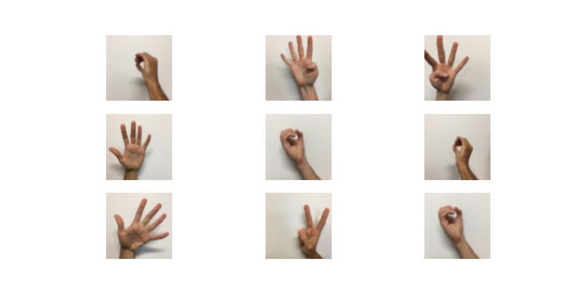
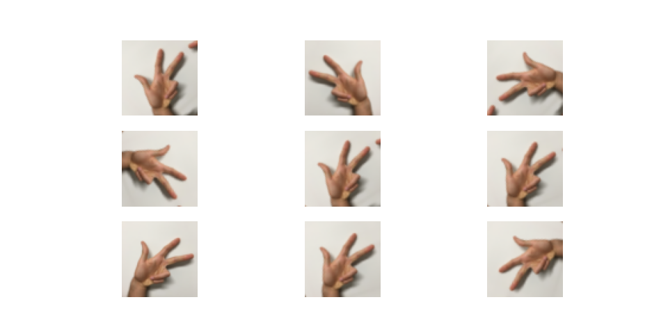
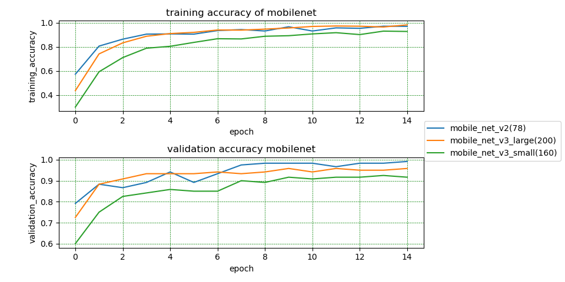
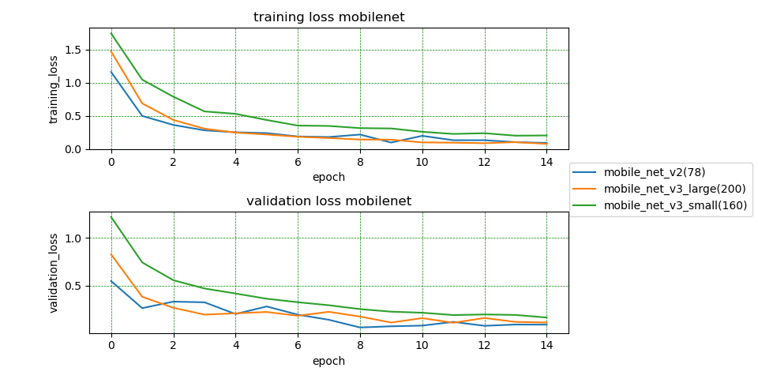
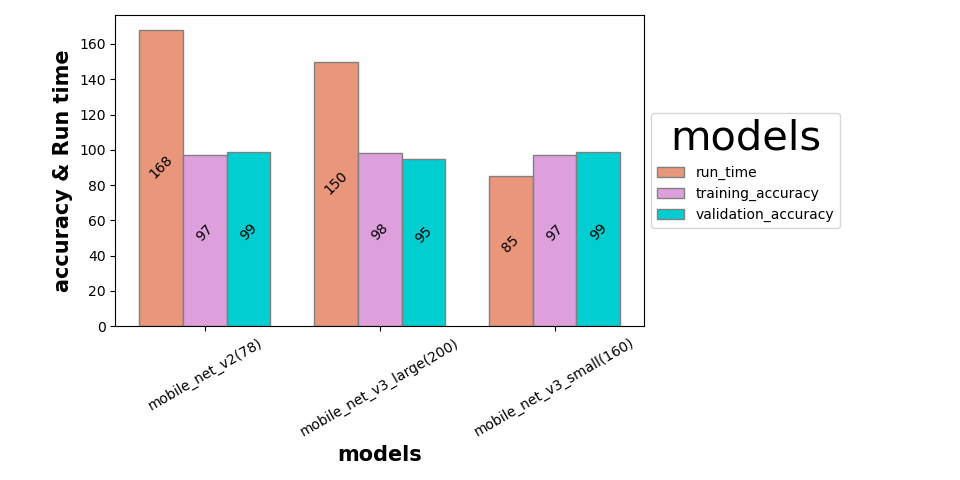
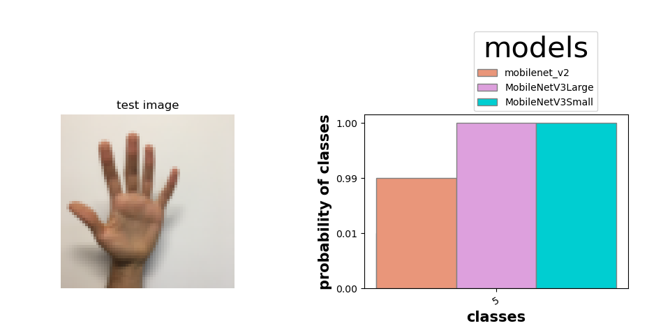

# hand_sign_classification
# this project is about to build a hand sign classifier using a convolution network called mobilenet with help of transfer learning.

in this project i have a data of almost 1000 images with different sign an 6 class as you can see in picture below

so i try to classifiy these image with the help of convolutional neural network . due low hardware resourses i choose a CNN called mobilenet which very computatinal efficient as compare to other so i go with mobilenet and the tensorflow there is three mobilenet CNN are available which is 
mobilenet_v2 , mobilenet_v3large , mobilenet_v3small.

first of all i loaded the data in image to tensor of dataset .
and then i apply the data augmentation to prevent the overfiting on training dataset
i have fliped horizontaly and rotate image by 0.2 as you can see in picture below

as there are three mobilenet CNN so i try tried all three and check which one have good accouray low run time 
first mobilenet_v2 with 155 layers , seconed is mobilenet_v3large with 263 layers and thired one is mobilenet_v3small with 229 layers

I used the transfer learning and freeze first 78 layers in mobilenet_v2 and 200 in mobilenet_v3large and 160 in mobilenet_v3small 
and rest are trainable and i got accuracy for all the models for training and validation set as you can see below in picture

and the loss for all the models is :

And the finally i evaluate the models with run time and training and validation accuracy so i ploted a bar graph for this evaluation 
as you can see below in picture ..

as you can see the above picture the run time for the mobilenet_v2(78) is very large but training and validation accuracy is quit good 
but in mobilenet_v3small the run time is low also the accuracy on training and validation on both are quit good.

Finally there is some predictin by all the models :

Thanks I learned so many things in this project .

[License](LICENSE)

[LinkedIn](https://www.linkedin.com/in/samunder-singh-265508202?lipi=urn%3Ali%3Apage%3Ad_flagship3_profile_view_base_contact_details%3Byxrir8euT9%2BVcZuwWbsddA%3D%3D)
